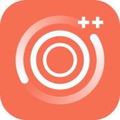

<div align="center">



# Zen Sync

**End-to-end encrypted sync of workspaces & tabs for [Zen Browser ++](https://github.com/limeflash/zen-browser-plus).**

[](#license)
[](server)
[](client)
[](docs/ARCHITECTURE.md)

</div>

Zen Sync keeps your spaces, tabs, groups and folders in sync across devices
through a self-hostable relay — **without the relay ever seeing your data**.
Everything is encrypted on-device with a key derived from a passphrase only you
know; the server stores nothing but ciphertext.

## Why a separate repo?
The sync feature spans two worlds — a browser-side module and a backend relay.
Keeping both here gives one **single source of truth**, a documented API
contract between them, and a server anyone can self-host. The browser consumes
[`client/`](client) as a **git submodule**.

## Layout
```
zen-sync/
├── client/   # browser-side module (consumed by zen-browser-plus as a submodule)
│   ├── modules/ZenSyncService.sys.mjs    # crypto + relay + reconciliation
│   ├── preferences/zenSync.inc.xhtml     # the Zen Sync settings pane
│   ├── preferences/zenSyncSettings.js    # pane controller (gZenSyncSettings)
│   └── locales/en-US/zen-sync.ftl
├── server/   # self-hostable FastAPI relay (zero-knowledge blob store)
│   ├── app/{main,models,storage}.py
│   ├── Dockerfile · Caddyfile.example · requirements.txt
└── docs/
    ├── API.md            # full HTTP contract
    └── ARCHITECTURE.md   # crypto + sync model
```

## Quick start (self-host the relay)
```bash
cd server
pip install -r requirements.txt
ZENSYNC_ALLOW_OPEN_REGISTRATION=true uvicorn main:app --port 8000   # or: docker build -t zensync ./server
```
Put Caddy (or any TLS proxy) in front — see [`server/Caddyfile`](server/Caddyfile) —
then open **Settings → Zen Sync** in the browser, enter your Relay URL + a
passphrase, and **Create Account**. On a second device choose **Join Existing
Account** with the Account ID + Key Salt shown on the first.

## Security at a glance
- **PBKDF2-HMAC-SHA-256** (100k iters) derives an **AES-256-GCM** key + an auth token.
- The relay stores only `auth_hash`, `salt`, and `{ciphertext, nonce, timestamp}` blobs.
- The raw passphrase is **never** persisted or transmitted.

Details: [docs/ARCHITECTURE.md](docs/ARCHITECTURE.md) · [docs/API.md](docs/API.md).

## License
- **`server/`, docs and tooling:** [MIT](LICENSE).
- **`client/` module:** [MPL-2.0](https://www.mozilla.org/MPL/2.0/) (per the file
  headers) — it derives from [Zen Browser](https://github.com/zen-browser/desktop)
  and [Mozilla Firefox](https://www.mozilla.org/firefox/), which are MPL-2.0.
